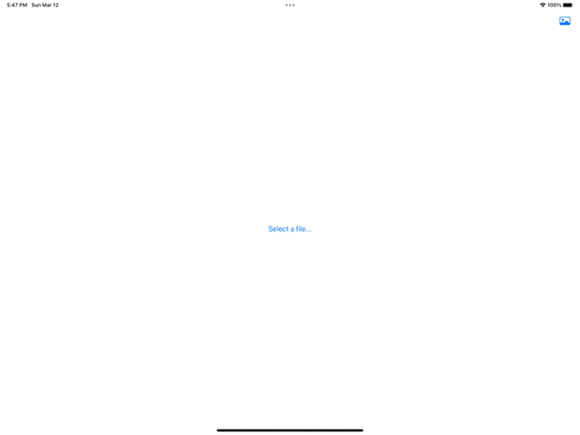

# ImageIOExample
11-Mar-2023 Flock of swifts meetup example.  Show cases:
* Using `UIDocumentBrowserViewController` in a `UIViewControllerRepresentable.
* static member lookup for `UTTypes`
* ImageIO to load images and metadata
* `OutlineGroup` with recursive content

